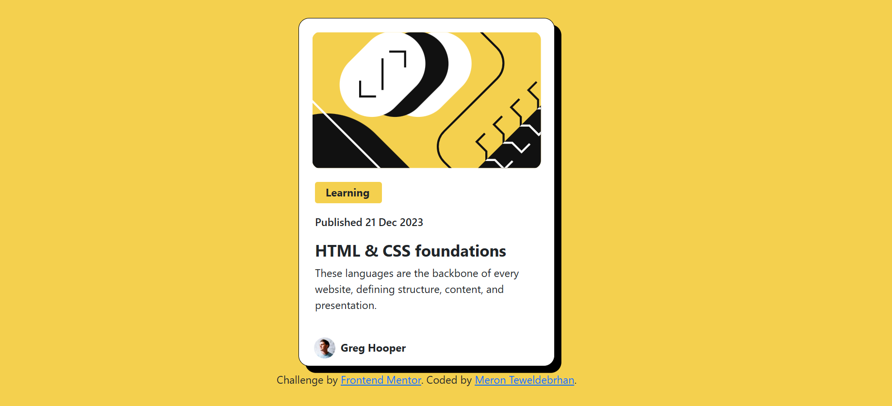

# 📰 Blog Preview Card - Frontend Mentor Challenge

# 📌 Overview
This project is a solution to the Frontend Mentor Blog Preview Card challenge.
The objective was to create a responsive and visually appealing card component using HTML and Bootstrap, focusing on layout structure, design responsiveness, and clean UI principles.





# 🔗 Links
* Live Site:[ View Live Demo <!-- Replace with your GitHub Pages, Netlify, or Vercel link -->](https://blogperviewcard.netlify.app/)
* Solution: [Frontend Mentor Solution Page](https://www.frontendmentor.io/solutions/blog-preview-card---using-html-and-css-BbRQHgoBrQ)

# ⚙️ My Process
1. Structured the HTML using semantic tags within a Bootstrap grid layout.
2.Integrated Google Fonts (Figtree) for clean typography.
3.Utilized Bootstrap's utility classes (like d-flex, gap, mb-*, shadow, and rounded) for spacing, layout, and alignment.
4.Applied Bootstrap box shadows for visual depth.
5.Arranged the avatar and author details using d-flex and alignment utilities.

# 🛠️ Built With
* Semantic HTML5
* ootstrap 5 (including Flexbox)
* Flexbox
* Google Fonts
* Mobile-first responsive design

 # 📚 What I Learned
* Leveraged Bootstrap's flex utilities to align elements horizontally and vertically with minimal custom CSS.
* Used Bootstrap’s shadow and spacing utilities for consistent design across devices.
* Maintained clean and reusable code by minimizing inline styles and favoring utility classes.
* Built a card layout that adapts fluidly to different screen sizes using Bootstrap’s responsive grid.

```html
<body class="d-flex flex-column justify-content-center align-items-center align-items-center min-vh-100" style="background-color:#F4D04E;">
  <section class="card rounded-4 p-3 bg-white border border-black" style="width: 384px;height: 522px; box-shadow: 10px 10px 0px 0px black;">
    
    <div class="rounded-1 fw-bold pt-1 pb-1 pe-3 ps-3  mt-3  mb-3 ms-2" style="max-width:100px; background-color: #F4D04E;"> Learning</div>
       <p class ="fs-6 fw-medium ms-2">Published 21 Dec 2023</p>
       <h1 class="fw-bold text-dark fs-4 mt--1  mb-2 ms-2" style="font-weight: 800;">HTML & CSS foundations</h1>
       <p class="ms-2">These languages are the backbone of every website, defining structure, content, and presentation.</p>
    <div class ="d-flex align-items-center justify-content-center "style="margin-top: 8px; margin-left: -200px;">
       
        <div class="fw-bold ms-2 mt-3" >
           <p>Greg Hooper</p>
        </div>
     </div>
  </section>
   <div class="fs-6 p-2">
      Challenge by 
      <a href="https://www.frontendmentor.io?ref=challenge" target="_blank">Frontend Mentor</a>. 
      Coded by 
      <a href="https://www.linkedin.com/in/meron-teweldebrhan/">Meron Teweldebrhan</a>.
  </div>
</body>
```

# 🔗 Useful Resources
* Bootstrap Flexbox Documentation
* Bootstrap Shadows
* Frontend Mentor Community

# 👤 Author
* Name: Meron Teweldebrhan 
* Frontend Mentor Profile:(https://www.frontendmentor.io/profile/MeronTeweldebrhan)
* Website:https://meronpf.netlify.app/
* GitHub:https://github.com/MeronTeweldebrhan

# 🙏 Acknowledgments
Thanks to Frontend Mentor for the challenge and to Per Scholas instructors for their guidance and support throughout my learning journey.

